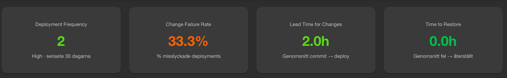

# dora-platform

DORA Metrics pipeline for Backstage — visualizes Deployment Frequency, Lead Time for Changes, Change Failure Rate, and Time to Restore from GitHub using a custom ingest service, Prometheus, and Grafana.



## Architecture

```
GitHub (deployment events)
  → webhook
    → dora-ingest (Node.js)
        → /metrics (Prometheus format)
          → Prometheus (90d retention)
            → Grafana (dashboards)
        → /dora/:owner/:repo (JSON API)
          → Backstage plugin
```

## Repository structure

```
dora-platform/
├── dora-ingest/          # Node.js webhook receiver + metrics
│   ├── index.js
│   ├── package.json
│   └── Dockerfile
├── dora-stack/           # Docker Compose for local development
│   ├── docker-compose.yml
│   ├── prometheus.yml
│   └── .env.example
└── dora-backstage/       # Modified Backstage files (from create-app)
    └── packages/app/src/
        ├── App.tsx
        └── components/
            ├── Root/Root.tsx
            └── DoraDashboard/
                ├── DoraDashboard.tsx
                └── index.ts
```

---

## Phase 1 — Local development

### Prerequisites

- macOS with Homebrew
- Node.js 20+ (via nvm)
- Yarn
- OrbStack or Docker Desktop
- Git

### 1. Install Node.js

```bash
brew install nvm

# Add to ~/.zshrc
export NVM_DIR="$HOME/.nvm"
[ -s "/opt/homebrew/opt/nvm/nvm.sh" ] && \. "/opt/homebrew/opt/nvm/nvm.sh"

nvm install 20
nvm use 20
nvm alias default 20

npm install -g yarn
```

### 2. Start Backstage

```bash
npx @backstage/create-app@latest
# Name the app e.g. dora-backstage

cd dora-backstage
yarn dev
```

Backstage runs at http://localhost:3000

### 3. Start dora-stack (Prometheus + Grafana + dora-ingest)

Start the stack:

```bash
docker compose up -d
```

Services:
- dora-ingest: http://localhost:8080
- Prometheus: http://localhost:9090
- Grafana: http://localhost:3001 (admin/admin)

### 4. Configure Grafana

1. Go to **Connections → Data sources → Add new data source → Prometheus**
2. URL: `http://prometheus:9090`
3. Click **Save & test**

### 5. Connect GitHub webhook

Expose dora-ingest publicly using Cloudflare Tunnel:

```bash
brew install cloudflared
cloudflared tunnel --url http://localhost:8080
```

Copy the generated URL (e.g. `https://abc123.trycloudflare.com`).

Go to your GitHub repository:
**Settings → Webhooks → Add webhook**

- Payload URL: `https://abc123.trycloudflare.com/webhook`
- Content type: `application/json`
- Events: **Deployments** and **Deployment statuses**

### 6. GitHub Action for deployment events

Add `.github/workflows/deploy.yml` to your repository:

```yaml
name: Deploy

on:
  push:
    branches: [main]

permissions:
  deployments: write

jobs:
  deploy:
    runs-on: ubuntu-latest
    steps:
      - name: Create deployment
        uses: actions/github-script@v7
        with:
          script: |
            const deployment = await github.rest.repos.createDeployment({
              owner: context.repo.owner,
              repo: context.repo.repo,
              ref: context.sha,
              environment: 'production',
              auto_merge: false,
              required_contexts: []
            });

            await github.rest.repos.createDeploymentStatus({
              owner: context.repo.owner,
              repo: context.repo.repo,
              deployment_id: deployment.data.id,
              state: 'success',
              environment: 'production'
            });
```

### 7. Copy Backstage files

After running `npx @backstage/create-app` — copy the files from `dora-backstage/` into your new project and run `yarn dev`.

The DORA dashboard is available at http://localhost:3000/dora

---

## API

### Webhook
```
POST /webhook
Header: x-github-event: deployment | deployment_status
```

### Metrics (Prometheus format)
```
GET /metrics
```

Exposed metrics:
- `github_deployments_total{repo, environment, status}`
- `github_deployment_failures_total{repo, environment}`
- `github_lead_time_seconds{repo, environment}`
- `github_time_to_restore_seconds{repo, environment}`

### DORA Summary (used by Backstage)
```
GET /dora/:owner/:repo
```

Example:
```bash
curl http://localhost:8080/dora/my-org/my-repo
```

Response:
```json
{
  "repo": "my-org/my-repo",
  "deploymentFrequency": 12,
  "changeFailureRate": "8.3%",
  "leadTimeHours": "2.4",
  "timeToRestoreHours": "0.5"
}
```

---

## Testing locally without GitHub

```bash
# Deployment created
curl -X POST http://localhost:8080/webhook \
  -H "Content-Type: application/json" \
  -H "x-github-event: deployment" \
  -d '{"id": 1, "repository": {"full_name": "org/repo"}, "environment": "production", "payload": {}}'

# Deployment success
curl -X POST http://localhost:8080/webhook \
  -H "Content-Type: application/json" \
  -H "x-github-event: deployment_status" \
  -d '{"deployment": {"id": 1, "environment": "production"}, "deployment_status": {"state": "success"}, "repository": {"full_name": "org/repo"}}'

# Deployment failure
curl -X POST http://localhost:8080/webhook \
  -H "Content-Type: application/json" \
  -H "x-github-event: deployment_status" \
  -d '{"deployment": {"id": 1, "environment": "production"}, "deployment_status": {"state": "failure"}, "repository": {"full_name": "org/repo"}}'
```

---

## DORA performance levels

| Metric | Elite | High | Medium | Low |
|---|---|---|---|---|
| Deployment Frequency | ≥7/week | ≥1/week | ≥1/month | <1/month |
| Change Failure Rate | ≤5% | ≤10% | ≤15% | >15% |
| Lead Time for Changes | ≤1h | ≤24h | ≤1 week | >1 week |
| Time to Restore | ≤1h | ≤24h | ≤1 week | >1 week |

---

## Security

- Shut down the Cloudflare tunnel when not in use: `pkill cloudflared`
- Disable the GitHub webhook during longer breaks: **GitHub → Settings → Webhooks → Edit → uncheck Active**
- Never commit `.env` — it is ignored by `.gitignore`
